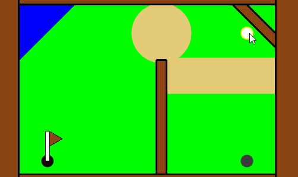
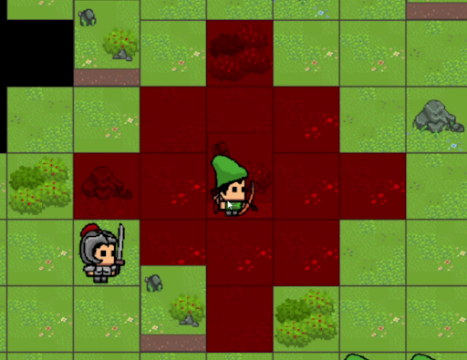
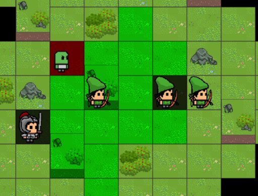
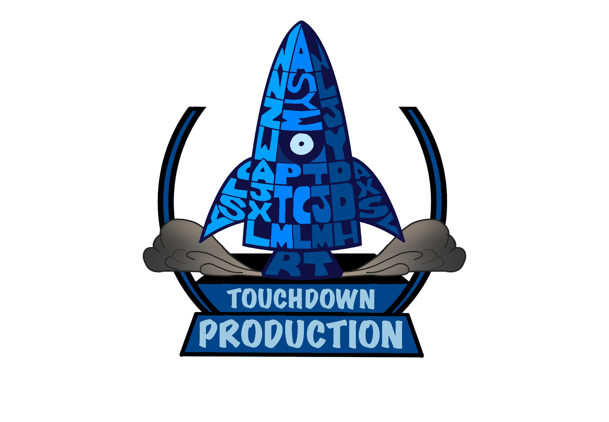

# About me
I am an aspiring game developer/programmer currently studying as a student in DigiPen Institute of Technology Singapore. Just a simple guy who loves games and passionate about creating immersive gaming experiences and exploring new technologies in game development.
## Skills
- Programming Languages: C, C++, C#, TypeScript, Python.
- Game Development Tools: Unity, Android Studios.
- Software Development: Knowledge of the proccess and creation of 2D/3D game engine. Slight experience in creating mobile apps and VR/AR applications.
## Contact Me
- Email: Ang_Jun_Xuan@hotmail.com
- LinkedIn: https://www.linkedin.com/in/warrenangjunxuan/

# Projects:
## ProjectGolf

### Description:
A simple Mini-Golf game created using C-Processing library that is provided by Digipen.
### What I have worked on:
- Programmed in C.
- Worked on the physics of the game.
- Designing and implementation of stages.

## Waddle Crusaders

### Description:
A 2D turn-based top-down tatical strategy game with varying levels, allowing players to choose from multiple unit types to bring into battle and arrange them to outsmart enemies. 
Using Alpha Engine as provided by Digipen faculty.
### What I have worked on:
- Programmed in C++.
- Implementation of sound in the game using the FMOD library.
- Implementation of a Input system with interactions to the keyboard.

## Derelict Land

### Description:
A 2D adventure side scroller with real-time 'turn-based' combat where players use items in their inventory to defeat enemies.
Using Omega Engine created by the technical team of the project.
### What I have worked on:
- Programmed in C++.
- Co-created a editor/engine to create a 2D game.
- Implementation of a Graphics system using openGL.
- Implementation of code to read .png to texture spritesheets used in both the editor and game of the using stb_image libraries.
- Implementation of a Animation system to animate spritesheets.
- Implementation of a Assets Manager for the management of all assets handled within the 2D Game Engine.

## Epilogue

<video width="640" height="360" controls autoplay muted loop>
        <source src="videos/Epilogue_GameTrailer.mp4" type="video/mp4">
        Your browser does not support the video tag.
 </video>
### Description:
A first-person stealth game, casting players in the role of Olivier, a thief with the unique ability to manipulate time, slowing it down.
Using Takeoff Engine created by the technical team of the project.
### What I have worked on:
- Programmed in C++.
- Co-created a editor/engine to create a 3D game.
- Implementation of a Assets Importer, that converts .png files into .dds format using compressonatorcli.exe, and also the reading of .fbx using assimp to later compress using lz4 and saved in a .yaml file for use in the editor/engine.
- Implementation of a Assets Manager for the management of model/texture assets handled within the 3D game Engine.
- Implementation of game scripts in C#.

